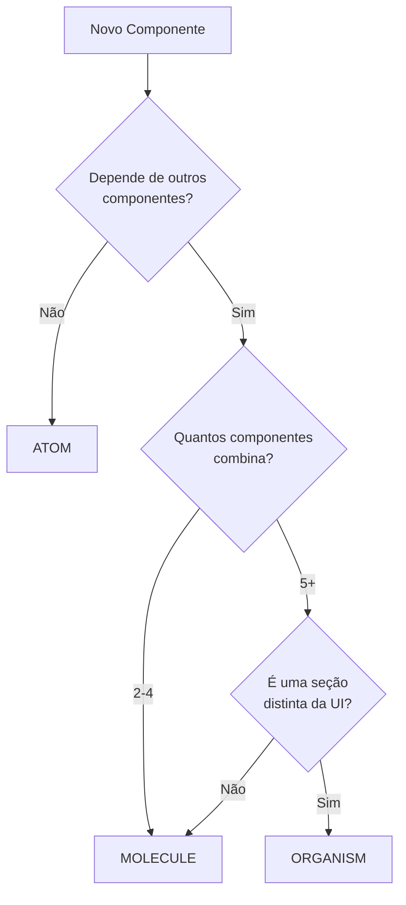

# Atomic Design Component Library

Este diretório segue a metodologia **Atomic Design** de Brad Frost para organizar componentes de UI de forma escalável e reutilizável.

## 📚 Metodologia

A Atomic Design divide componentes em 5 níveis hierárquicos, do mais simples ao mais complexo:

```
Atoms → Molecules → Organisms → Templates → Pages
```

### 🔹 Atoms (Átomos)
**Blocos básicos fundamentais** - Não podem ser quebrados sem perder funcionalidade.

Exemplos: `Button`, `Input`, `Avatar`, `Separator`, `Skeleton`, `Tooltip`

```tsx
import { Button, Input, Avatar } from '@workspace/ui/components';

<Button>Clique aqui</Button>
<Input placeholder="Digite algo..." />
<Avatar src="/foto.jpg" alt="Usuário" />
```

**Quando criar um átomo:**
- ✅ É um elemento HTML básico estilizado (button, input, label)
- ✅ Não depende de outros componentes para funcionar
- ✅ É altamente reutilizável em múltiplos contextos
- ❌ Não deve conter lógica de negócio

---

### 🧬 Molecules (Moléculas)
**Combinações de átomos trabalhando juntos** - Formam unidades funcionais simples.

Exemplos: `DropdownMenu`, `Sheet`, `Tag`, `FilePreview`

```tsx
import { DropdownMenu, Sheet, Tag } from '@workspace/ui/components';

// Molécula: combina Button + Menu
<DropdownMenu>
  <DropdownMenuTrigger asChild>
    <Button>Menu</Button>
  </DropdownMenuTrigger>
  <DropdownMenuContent>
    <DropdownMenuItem>Opção 1</DropdownMenuItem>
  </DropdownMenuContent>
</DropdownMenu>

// Molécula: combina múltiplos átomos
<Tag variant="success" onRemove={() => {}}>
  JavaScript
</Tag>
```

**Quando criar uma molécula:**
- ✅ Combina 2-4 átomos em uma funcionalidade específica
- ✅ Tem um propósito claro e único (ex: "search bar", "card header")
- ✅ Pode ser reutilizada em diferentes organismos
- ❌ Não deve ser uma seção completa da interface

---

### 🦠 Organisms (Organismos)
**Componentes complexos e distintos** - Formam seções da interface.

Exemplos: `AppLayout`, `AppSidebar`, `ImageUploader`, `DynamicTagInput`

```tsx
import { AppLayout, ImageUploader } from '@workspace/ui/components';

// Organismo: layout completo da aplicação
<AppLayout
  appTitle="Meu App"
  navItems={items}
>
  <ConteúdoPrincipal />
</AppLayout>

// Organismo: uploader completo com preview, drag & drop, etc.
<ImageUploader
  onUploadComplete={(url) => console.log(url)}
  onUploadError={(error) => console.error(error)}
/>
```

**Quando criar um organismo:**
- ✅ Combina múltiplas moléculas e/ou átomos
- ✅ Representa uma seção distinta da UI (header, sidebar, form, card)
- ✅ Pode conter lógica de negócio específica
- ✅ Geralmente é usado uma vez por página/template

---

### 📄 Templates (Em breve)
**Layouts de página** - Estruturas sem conteúdo real, apenas placeholders.

Exemplos: `DashboardTemplate`, `ArticleTemplate`, `ProfileTemplate`

Templates são como blueprints - definem onde os organismos serão posicionados na página.

---

### 🌐 Pages (Gerenciadas pelo Next.js)
**Instâncias específicas de templates** - Contêm conteúdo real e dados.

No contexto do Next.js, as "pages" vivem em `apps/*/app/` ou `apps/*/src/pages/`.

---

## 🗂️ Estrutura de Pastas

```
components/
├── atoms/              # Elementos básicos
│   ├── button.tsx
│   ├── input.tsx
│   ├── avatar.tsx
│   └── index.ts       # Barrel export
│
├── molecules/          # Combinações simples
│   ├── dropdown-menu.tsx
│   ├── sheet.tsx
│   ├── tag.tsx
│   └── index.ts
│
├── organisms/          # Seções complexas
│   ├── app-layout.tsx
│   ├── app-sidebar.tsx
│   ├── image-uploader.tsx
│   └── index.ts
│
├── templates/          # Layouts de página (futuro)
│   ├── dashboard-template.tsx
│   └── index.ts
│
├── index.ts            # Export principal
└── README.md           # Esta documentação
```

---

## 🎯 Como Usar

### Import Simplificado (Recomendado)

Graças aos barrel exports, você pode importar tudo de um lugar:

```tsx
import {
  Button,
  Input,
  DropdownMenu,
  AppLayout
} from '@workspace/ui/components';
```

### Import Específico (Otimização)

Para tree-shaking otimizado, importe do nível atômico específico:

```tsx
import { Button } from '@workspace/ui/components/atoms';
import { DropdownMenu } from '@workspace/ui/components/molecules';
import { AppLayout } from '@workspace/ui/components/organisms';
```

---

## 🛠️ Criando Novos Componentes

### 1. Identifique o Nível Atômico



### 2. Crie o Arquivo no Lugar Correto

```bash
# Átomo
packages/ui/src/components/atoms/my-atom.tsx

# Molécula
packages/ui/src/components/molecules/my-molecule.tsx

# Organismo
packages/ui/src/components/organisms/my-organism.tsx
```

### 3. Exporte no index.ts Correspondente

```ts
// Em atoms/index.ts
export { MyAtom, type MyAtomProps } from './my-atom';

// Em molecules/index.ts
export { MyMolecule, type MyMoleculeProps } from './my-molecule';

// Em organisms/index.ts
export { MyOrganism, type MyOrganismProps } from './my-organism';
```

### 4. Use Named Exports (SEMPRE)

```tsx
// ✅ CORRETO
export function Button({ children }: ButtonProps) {
  return <button>{children}</button>;
}

// ❌ ERRADO
export default function Button({ children }: ButtonProps) {
  return <button>{children}</button>;
}
```

---

## 🎨 Exemplos Práticos

### Exemplo 1: Criando uma Search Bar (Molécula)

```tsx
// molecules/search-bar.tsx
import { Input } from '../atoms/input';
import { Button } from '../atoms/button';
import { Search } from 'lucide-react';

export interface SearchBarProps {
  onSearch: (query: string) => void;
  placeholder?: string;
}

export function SearchBar({ onSearch, placeholder }: SearchBarProps) {
  const [query, setQuery] = React.useState('');

  return (
    <div className="flex gap-2">
      <Input
        value={query}
        onChange={(e) => setQuery(e.target.value)}
        placeholder={placeholder}
      />
      <Button onClick={() => onSearch(query)}>
        <Search className="size-4" />
      </Button>
    </div>
  );
}
```

### Exemplo 2: Criando um Header (Organismo)

```tsx
// organisms/app-header.tsx
import { Avatar } from '../atoms/avatar';
import { Button } from '../atoms/button';
import { DropdownMenu } from '../molecules/dropdown-menu';
import { SearchBar } from '../molecules/search-bar';

export function AppHeader() {
  return (
    <header className="flex items-center justify-between p-4">
      <h1>Meu App</h1>

      <SearchBar onSearch={(q) => console.log(q)} />

      <DropdownMenu>
        <DropdownMenuTrigger>
          <Avatar src="/user.jpg" />
        </DropdownMenuTrigger>
        <DropdownMenuContent>
          <DropdownMenuItem>Perfil</DropdownMenuItem>
          <DropdownMenuItem>Sair</DropdownMenuItem>
        </DropdownMenuContent>
      </DropdownMenu>
    </header>
  );
}
```

---

## ✨ Benefícios desta Estrutura

1. **🔍 Fácil de Encontrar**: Sabe exatamente onde cada tipo de componente está
2. **♻️ Reutilização Máxima**: Componentes são projetados para serem compostos
3. **📦 Imports Limpos**: Barrel exports simplificam imports
4. **🧪 Testável**: Cada nível pode ser testado isoladamente
5. **📚 Documentação Natural**: A estrutura é autodocumentada
6. **🎨 Design System**: Facilita manutenção de design consistente
7. **👥 Colaboração**: Vocabulário comum para toda a equipe

---

## 📖 Referências

- [Atomic Design - Brad Frost](https://atomicdesign.bradfrost.com/)
- [Thinking About React, Atomically](https://blog.isquaredsoftware.com/2017/10/thinking-in-react-atomic-design/)
- [Building better UIs with Atomic Design](https://www.justinmind.com/ui-design/atomic-design)

---

**Última atualização:** 2025-11-07
**Versão:** 1.0.0
**Mantido por:** Equipe Solilóquio 🔮
